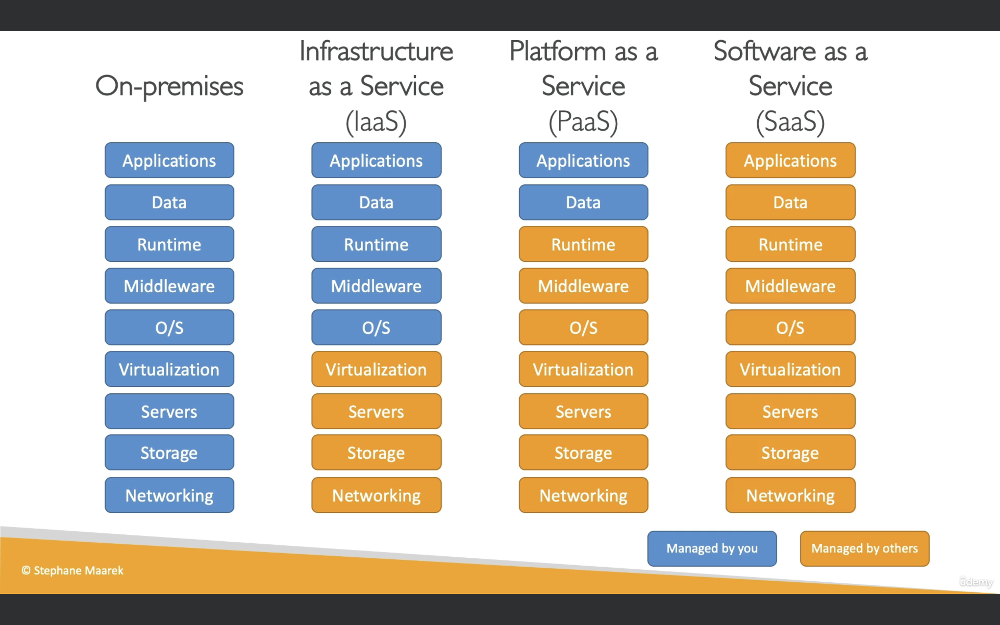

Initially, when people started companies, they would buy a server from a store and put the server at home in their garage. As your company grows, you need to get more and more servers so you need to buy more and more servers. Then when the garage and house is too small then you move all your servers to an office, and you decide to allocate a special room called data centers.

## Problems with the traditonal IT approach:

- Pay for the rent of the data center
- Pay for power supply, cooling, maintenence
- Adding and replacing hardware takes time because you have to order them and hook them up
- Scaling is limited, number of servers to be bought might become exponential and you might not have the time or effort to do so.
- Will need to hire a team 24/7 to monitor the infrastructure
- Natural disasters (earthquake, power shutdown, fire)

## What is Cloud Computing?

- Cloud computing is the on-demand computing of compute power, database storage, applications and other IT resources.
- There is pay-as-you-go pricing. When you are done using resources, you no longer need to pay for it.
- You can provision exactly the right type and size of computing resources you need
- You can access as many resources as you want almost instantly

## Types of Cloud Services

### Private Cloud

- Eg. Rackspace
- Cloud Services used by a single organization, not exposed to the public
- Complete control over it
- Security for sensitive applications which may meet specific business needs

### Public Cloud

- Eg. Microsoft Azure, Google Cloud and AWS
- Cloud resources owned and operated by a third-party cloud service provider delivered over the internet

### Hybrid Cloud

- Keep some servers on premises and extend some capabilities to the cloud
- Best of two worlds. You have control over your sensitive assets in your private infrastructure
- You have the flexibility and cost-effectiveness of the public cloud.

## Five characteristics of cloud computing

- Fully on-demand and self-service
  - Users can provision resources and use them without human interaction from the service provider
- Broad network access
  - Resources available over the network, can be accessed by diverse client platforms
- Multi-tenancy and resource pooling
  - Multiple customers can share the same infrastructure and applications with security and privacy
  - These multiple customers are serviced from the same physical resources
- Rapid elasticity and scalability
  - Automatically and quickly acquire and dispose resources when needed
  - Quickly and easily scale based on demand
- Measured Service
  - Usage is measured and users will pay for exactly what they have used

## Six Advantages of Cloud Computing

- Trade capital expenses (CAPEX) for operational expenses (OPEX)
  - That means you don't own hardware and will pay on-demand.
  - Results in reduced Total Cost of Ownership (TCO) and Operational Expense (OPEX)
- Benefit from massive economies of scale
  - Since so many customers use cloud, the prices will be reduced as AWS is more efficient due to large scale
- Stop guessing capacity
  - We can scale automatically based on the actual measured usage
- Increased speed and agility
  - We can create, operate and do stuff right away without blockers
- Stop spending money running and maintaining data centers
- Go global in minutes: leverage the AWS global infrastructure

## Problems solved by Cloud

- Flexibility: change resource types when needed
- Cost-effective: pay as you go, for what you use
- Scalability: accomodate larger loads by making hardware stronger or adding additional nodes
- Elastic: ability to scale out and scale-in when needed
- High-availability and Fault-tolerence: build across data centers
- Agility: Rapidly develop, test and launch software applications

## Types of Cloud Computing

- Infrastructure as a Service (IaaS)
  - Provides building blocks for cloud IT
  - Provides networking, computers, data storage space
  - Highest level of flexibility
  - Easily understand how to migrate from traditional on-premises IT to the cloud.
  - Examples: Amazon EC2, GCP, Azure, Rackspace, Digital Ocean, Linode
- Platform as a Service (PaaS)
  - Removes the need for your organization to manage the underlying infrastructure
  - Focus on the deployment and management of your applications
  - Examples: Elastic Beanstalk, Heroku, Google App Engine, Windows Azure
- Software as a Service (SaaS)
  - Completed product that is run and managed by the service provider
  - Many AWS services (eg Rekognition for Machine Learning)
  - Google Apps (gmail), dropbox or zoom

## AWS Pricing

## How to choose an AWS region?

- **Compliance** with data governance and legal requirements: data never leaves a region without your explicit permission eg France, India

- **Proximity** to customers: reduced latency. If your users are in Australia but you are using America servers, there will be a lot of lag/delay with performing tasks
- **Available services** within a region: not all regions have all new services and features, if you are using a specific service, you need to make sure your region has that service

- **Pricing** varies from region to region and is transparent in the service pricing page

## AWS Availability Zones
