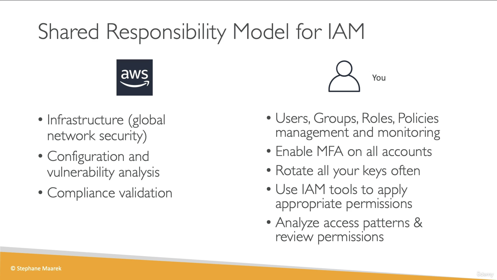

- Global service since we are going to create users and assign them to groups
- When we created the account, we created the **root** account. The only thing you should use it for is to set up your IAM account.
- Users can be grouped together
- Groups can only contain users, not other groups
- A user can belong to multiple groups
- A user doesn't have to be allocated to a group but that is not good practice
  
- Users or groups can be assigned JSON documents called policies that gives the user permissions
- You apply the **least privilege principle**. Don't give more permission than a user needs
- Each user will inherit policies based on their group type. If they are not in a group, they will inherit the inline policies
  

## IAM Policies Structure

## IAM MFA

- Prevent accounts from being compromised
- In AWS you can set your own password policy:
  - Set a minimum password length
  - Require specific character types including
    - uppercase letter
    - lowercase letter
    - numbers
    - non-alphanumeric characters
  - Go to IAM > Account Settings under `Access Management` and you can modify your Password Policy there.
  - Allow all IAM users to change their own passwords
  - Require users to change their passwords after some time (for eg 90 days)
  - Prevent password re-use
- Types of MFA device options in AWS
  - Virtual MFA Device (Authenticators). Support for multiple tokens on a single device
    - Google Authenticator (phone only)
    - Authy (multi-device)
  - Universal 2 Factor (U2F) Security Key. Support for multiple root and IAM users using a single security key
    - Yubikey by Yubico (3rd party key)
  - Hardware Key Fob MFA device
    - Provided by Gemalto (3rd party)
  - Hardware Key Fob MFA Device for AWS GovCloud (US) if you are using AWS for government
    - Provided by SurePassID

## AWS Access Keys, CLI and SDK

### How can users access AWS?

1. AWS Management Console (protected by password + MFA)
2. AWS Command Line Interface (CLI): protected by access keys
3. AWS Software Developer Kit (SDK) for code: protected by access keys

- Access Keys are generated through the AWS console
- Users manage their own access keys

[!IMPORTANT]  
Access Keys are secret, just like your password. Don't share them.

### What's the AWS CLI?

- A tool that enables you to interact with AWS services using commands in your command-line shell
- Direct access to the public APIs of AWS Services
- You can develop scripts to manage resources
- It's [open sourced](https://www.github.com/aws/aws-cli/)
- Alternative to using the AWS management console

### What's the AWS SDK?

- Language-specific APIs (set of libraries)
- Enables you to access and manage AWS services programmatically.
- It is not something you use within your terminal, it is something you embed into your application when you code.
- Supports multiple languages: JavaScript, Python, Go, PHP, .NET, Ruby, Java, NodeJS, C++

## AWS CLI

1. In `aws.amazon.com`, go to IAM console and click on your username.
2. Scroll down and go to `Security Credentials` and `Create Access Key`.
3. Select the use case you want and you'll see that aws recommends different alternatives to access keys since access keys are long-term credentials and that makes them less secure.
4. Once you accept the conditions and create an access key, you'll get an access key and password, you can only view them while on this page, once you close the page you can no longer find your password, in which case you'll need to create a new access key or hopefully have the password stored somewhere.
5. Now go to your terminal and type in `aws configure`. You will be prompted to enter your Access ID (username), Secret Access Key (password) and default region name (enter the region you use on `aws.amazon.com`, eg `us-west-2`). This will configure your aws cli
6. You can test that everything is working by typing in `aws iam list-users` in your terminal. The data will match the data you see on the aws gui website.

## AWS Cloudshell

AWS Cloudshell is the terminal like icon at the top right of your screen as shown highlighted in the red box below

It is currently available in the following regions:

- US East (Ohio)
- US East (N. Virginia)
- US West (N. California)
- US West (Oregon)
- Asia Pacific (Mumbai)
- Asia Pacific (Osaka)
- Asia Pacific (Seoul)
- Asia Pacific (Sydney)
- Asia Pacific (Singapore)
- Asia Pacific (Tokyo)
- Canada (Central)
- Europe (Frankfurt)
- Europe (Ireland)
- Europe (London)
- Europe (Paris)
- Europe (Stockholm)
- South America (São Paulo)

Cloudshell works exactly similar to your local terminal.
You can also create and store files on cloudshell. So if you create a file using `touch abc.txt` and you close your cloudshell and open it again, `abc.txt` will remain.

You can also change the font sizes, download and upload files

## IAM Roles for AWS Services

- Some AWS Services need to perform actions on your behalf
- To do so, we will assign permissions to AWS services with IAM roles
- Common roles are:
  - EC2 Instance roles
  - Lambda function roles
  - Roles for CloudFormation
- You can see the list of IAM roles by going into the IAM console and clicking on `Roles` under `Access Management`

## IAM Security Tools

### IAM Credentials Report (account-level)

- A report that lists all your account's users and the status of their various credentials
- Credential reports are available in IAM console, and then searching for `Credential Report` under `Access Reports`
- You can simply download the report that will download as a .csv file

### IAM Access Advisor (user-level)

- Access advisor shows the service permissions granted to a user and when those services were last accessed
- You can use this information to revise your policies
- Access Advisor is available by going to `Users` and clicking on the user's name and then in the last tab you'll see `Access Advisor`

## IAM Guidelines and Best Practices

- Don't use the root account except when you set up AWS Accounts
- One physical user = One AWS user. If one user wants to access your AWS, don't give them your credentials, create a user account for them.
- Assign users to groups and assign permissions to groups
- Create a strong password policy
- Use and enforce the use of MFA (Multi-Factor Authentication)
- Create and use Roles for giving permissions to AWS Services
- Use Access Keys for Programmatic Access (CLI/SDK)
- To audit the permissions of your account, use IAM Credentials Report and IAM Access Advisor
- NEVER EVER SHARE YOUR ACCESS KEYS

## IAM Shared Responsibility

