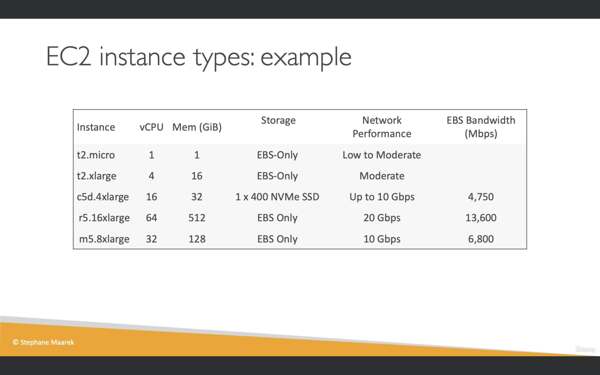
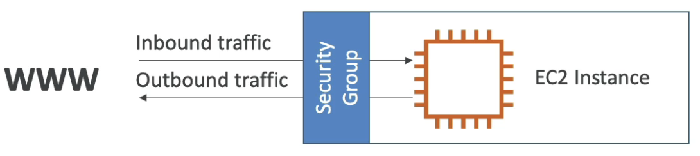
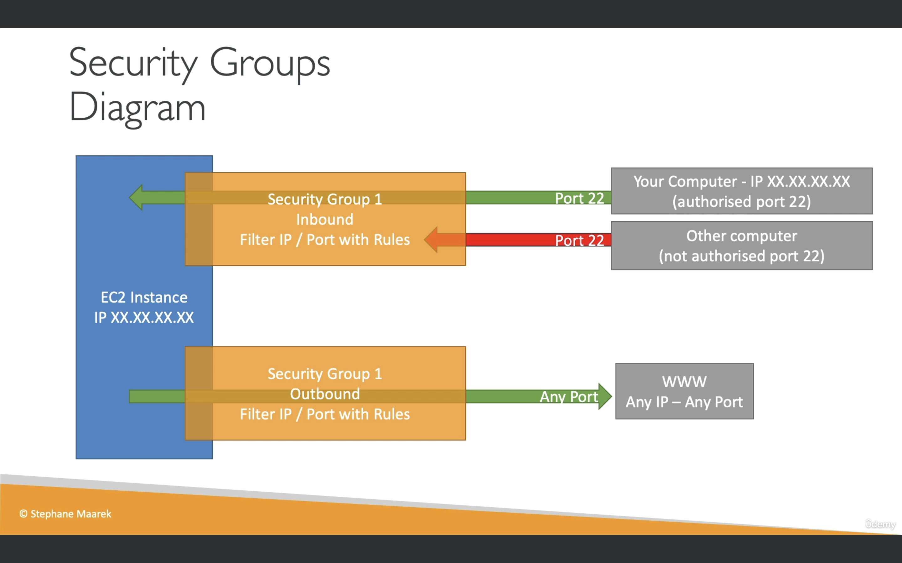
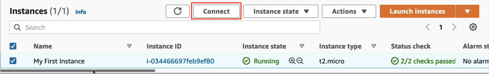

## AWS Budget Setup

- If you click on your username on the top right corner and
  click on `Billing Dashboard`, you can set up your budget. Note that if you are an IAM user it will ask for permissions 

- To solve this login to your root account, click on `My Account`, scroll down and you will find a setting called `IAM User and Role Access to Billing Information`. Edit this and `Activate IAM Access`. Now you can login back into your IAM account and see your billing dashboard.
- When you access the dashboard, you might see that you have a charge. You can find the source of the charge by going to `Bills` on the left-hand side, click on the `Try the new Bills page experience` 
- You will now be able to view the total interface. Scroll down and select `Charges by service`. You will be able to charges there.
- So for example, if `Elastic Cloud Compute` is deducing money, you can see it like this:  You can then click on `US East (N. Virginia)` and see in-depth details  In this particular case, you would go to your `Elastic Compute Cloud` Console, you would switch to the `N. Virginia` region, then go to the `EBS` secion and delete the volume that is incurring charges.
- You can also click on `Free Tier` on left hand side and see how much resources you are using of the Free Tier and whether you'll start incurring charges from them.
- You can set up an alarm by going into `Budgets` on the left side and `Create budget`.
- That way you can set up a budget `using a template` and then selecting the `Zero Spend Budget` which will notify you via email when you exceed your AWS Free Tier

## Amazon EC2

- Stands for Elastic Compute Cloud, it is an Infrastructure-as-a-Service.
- It mainly consists of the capability to:

  - Rent virtual machines
  - Storing data on virtual hard drives (EBS)
  - Distributing load across machines (ELB)
  - Scaling the services using an auto-scaling group (ASG)

## EC2 sizing and configuration options

- Operating System (OS): Linux (most popular), Windows and Mac OS
- How much compute power and cores (CPU)
- How much Random Access Memory (RAM)
- How much storage space:
  - Network-attached (EBS and EFS)
  - hardware (EC2 instance store)
- Network attached to EC2 instance: What kind of IP do you want, do you want the network card to be fast
- Firewall rules: security group
- Bootstrap script (configure at first launch): EC2 user data

## EC2 User Data

- It is possible to bootstrap our instances using an EC2 User Data Script
- Bootstrapping means launching commands when a machine starts
- That script is run only once when the instance first starts and then is never run again
- EC2 user data is used to automate boot tasks such as:
  - Installing updates
  - Installing software
  - Download common files from the internet
  - Anything you can think of
- The EC2 user data script runs with the root user



t2.micro is part of the AWS free tier (upto 750 hours per month)

## Hands On: Launching our first EC2 instance running Linux

1. Go into the EC2 Console
2. Click on `Instances` on the left-hand side
3. Click on `Launch Instances`
4. You can now name and tag your instance, for example, `test instance`
5. We are going to use the ones from `Quick Start`. Here, we will be using `Amazon Linux` which is provided by AWS.
6. Then we will select a Free Tier Eligible Image, for example `Amazon Linux 2 AMI (HVM)`
7. Select the 64-bit (x86) architecture
8. Next we need to choose an instance type. Select the free-tier eligible instance: `t2.micro`
9. Next you select the key-pair, which will be used if you are going to SSH, which we are. Create a new key-pair or use an existing one if you have one. Specify the key pair type (`RSA` by default) and the private key file format (.pem for MacOS, Linux and Windows 10, .ppk for Windows 8.1 and below). This will download a private key file to your machine. Make sure to remove the space from the pem file
10. Now, back in the `Launch an Instance` section, when you scroll to the end, you will find `User data - Optional`. This is where we will pass our script (some commands) to our EC2 instance to execute only and only on the first launch

    ```python
    #!/bin/bash
    # Use this for your user data (script from top to bottom)
    # install httpd (Linux 2 version)
    yum update -y
    yum install -y httpd
    systemctl start httpd
    systemctl enable httpd
    echo "<h1>Hello World from $(hostname -f)</h1>" > /var/www/html/index.html
    ```

11. Finally click on `Launch Instance`. You can then go back to the `Instances` page and search for your instance. Click on it and it will provide you with details, you shall be using the public IPv4 to connect to your Instance.

## EC2 instance types

- Different types of instance types have different types of use cases
- Instance types keep on being updated. You can find the whole list of instance types [here](https://aws.amazon.com/ec2/instance-types/)
  - General Purpose
  - Compute Optimized
  - Memory Optimized
  - Accelerated Computing
  - Storage Optimized
  - Instance Features
  - Measuring Instance Performance
- AWS has the following naming convention `m5.2xlarge` where
  - `m` is the instance class, in this case general purpose
  - `5` is the generation of the instance. AWS improves them over time
  - `2xlarge` is the size within the instance class. The more the size, the more the memory and cpu you'll have in your instance

### General Purpose

- Great for diversity of workloads such as web servers and code repositories
- Balance between
  - Compute
  - Networking
  - Memory
- In our case, we are using t2.micro which is a general purpose EC2 instance

### Compute Optimized

- Great for compute-intensive tasks that require high-performance processors such as
  - Batch processing workloads
  - Media transcoding
  - High Performance Web Servers
  - High Performance Computing (HPC)
  - Scientific modeling and Machine Learning
  - Dedicated gaming servers

### Memory Optimized

- Fast performance for workloads that process large data sets in memory such as
  - High Performance, relational / non-relational databases
  - Distributed web scale cache stores
  - In-memory databases optimized for BI (business intelligence)
  - Applications performing real-time processing of big unstructured data

### Storage Optimized

- Great for storage intensive tasks that require high sequential read and write access to large datasets on local storage for example

  - High frequency online transaction processing (OLTP) systems
  - Relational and NoSQL databases
  - Cache for in-memory databases (for eg Redis)
  - Data Warehousing Applications
  - Distributed File Systems

- You can compare all the EC2 instances [here](https://instances.vantage.sh/)

### Security Groups

- Security groups are the fundamental security in AWS
- They control how traffic is allowed into or out of our EC2 instances
- Security groups only contain allow rules
- Security group rules can be referenced by IP or by security group
  
- Security groups act as a "firewall" for EC2 instances
- They regulate:
  - Access to ports
  - Authorized IP ranges - IPv4 and IPv6
  - Control of inbound network (from other to the instance)
  - Control of outbound network (from the instance to the other)
    
- Security groups can be attached to multiple instances
- They are not locked to a region/VPC combination
- Do live outside of the EC2. If traffic is blocked the EC2 instance won't see it
- > It's good to maintain a seperate security group for SSH access
- If your application is not accessible (time out) then it is a security group issue
- If your application gives a "connection refused" error then it's an application error or it did not launch
- All inbound traffic is blocked by default
- All outbound traffic is authorized by default

### Classic Ports to know

- 22: SSH (Secure Shell) - log into a Linux instance
- 21: FTP (File Transfer Protocol) - upload files into a file share
- 22: SFTP (Secure File Transfer Protocol) - upload files using SSH
- 80: HTTP - access unsecured websites
- 443: HTTPS - access secured websites
- 3389: RDP (Remote Desktop Protocol) - log into a Windows instance

> You can access your security groups by going into your EC2 management console, and then in the left tabs scrolling down into `Network and Security` and selecting `Security Groups`

## SSH into Linux or Mac

1. Go into the location where you have your `.pem` file and `chmod 400` your pem file.
2. Go into your EC2 instance, go to `Security` and make sure port 22 is there in source 0.0.0.0/0. If it is not, click on `Security Groups` and add it.
3. Finally, ssh into your instance by typing in `ssh -i <your pem file name> ec2-user@<your Public IPv4 DNS>`. ec2-user is the default user that gets created
4. You can test whether your instance is working by typing in the command `whoami` which will give you `ec2-user` or `ping google.com` that will ping google.

## EC2 instance connect

You can connect to your EC2 instance through the console by opening your EC2 instance name in `Instances` and clicking on `Connect`


> Note that your username is `ec2-user` by default

## EC2 Instance Roles

- Configuring WS using `aws configure` on your AWS instance is a risky move because then anyone will be able to access your instance. Instead, it's better to give roles by going into your instance tab on console, going into the `Security` tab and selecting your IAM role. You can test that your role is working by typing into your instance console `aws iam list-users`

## EC2 Purchasing Options

### On-Demand Instances

- The ec2 instance we were using is an example of this
- They are good for short workload, predictable pricing and pay by second
- Linux or Windows: Billing per second, after the first minute. For all other systems, billing per hour
- Has the highest cost but no upfront payment and no long-term commitment
- **Recommended for short-term and uninterrupted workloads where we can't predict how the application will behave**

### Reserved

- For 1 or 3 years
- Reserved Instances: Good for long workloads
- Convertible Reserved Instances: Good if you want to change the instance type over time / flexible instance type
- Upto 72% discount compared to on-demand
- You reserve specific instance attributes like instance type, region, tenancy, OS
- Reservation Period of 1 year (additional discount on top of mentioned previously) or 3 years (even more discount than 1 year)

### Savings Plans

- For 1 or 3 years
- Instead of committing to a specific instance type, you commit to a specific amount of usage in cash and are used for long workloads
- Payment options are
  - No Upfront (some more discount)
  - Partial Upfront (2 times more discount)
  - All Upfront (3 times more discount)
- Reserved Instance's scope - Regional or Zonal (reserve capacity in an AZ)

### Spot Instances

- Meant for very short workloads
- Very cheap
- Can lose instances at any point making them less reliable

### Dedicated Hosts

- Book an entire server
- Control instance placement

### Dedicated Instances

- No other customers will be able to share your hardware

### Capacity Reservations

- Reserve capacity in a specific Availability Zone for any duration
