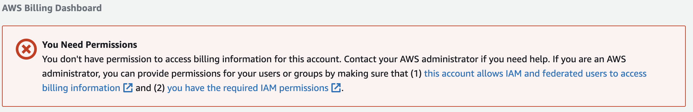
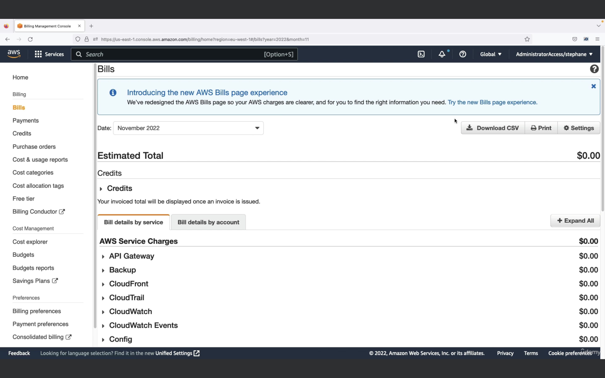
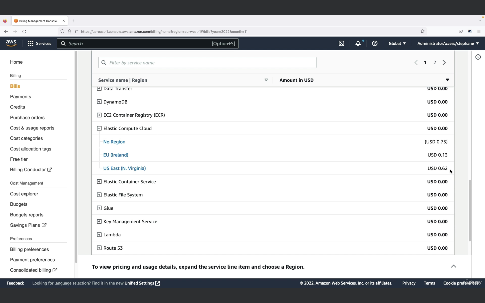
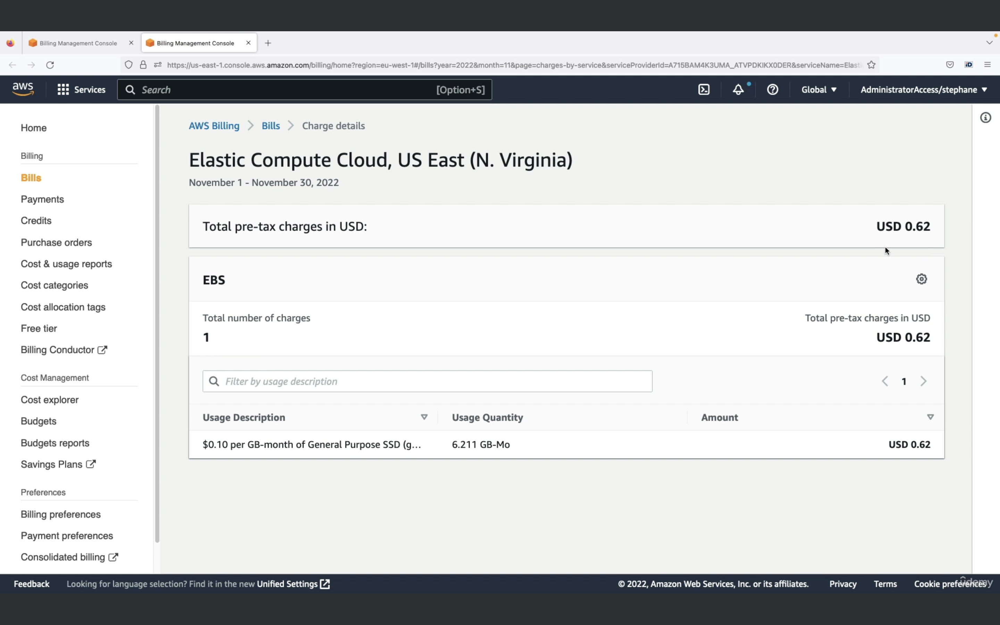

## AWS Budget Setup

- If you click on your username on the top right corner and 
click on `Billing Dashboard`, you can set up your budget. Note that if you are an IAM user it will ask for permissions 

- To solve this login to your root account, click on `My Account`, scroll down and you will find a setting called `IAM User and Role Access to Billing Information`. Edit this and `Activate IAM Access`. Now you can login back into your IAM account and see your billing dashboard.
- When you access the dashboard, you might see that you have a charge. You can find the source of the charge by going to `Bills` on the left-hand side, click on the `Try the new Bills page experience` 
- You will now be able to view the total interface. Scroll down and select `Charges by service`. You will be able to charges there.
- So for example, if `Elastic Cloud Compute` is deducing money, you can see it like this:  You can then click on `US East (N. Virginia)` and see in-depth details  In this particular case, you would go to your `Elastic Compute Cloud` Console, you would switch to the `N. Virginia` region, then go to the `EBS` secion and delete the volume that is incurring charges.
- You can also click on `Free Tier` on left hand side and see how much resources you are using of the Free Tier and whether you'll start incurring charges from them.
- You can set up an alarm by going into `Budgets` on the left side and `Create budget`.
- That way you can set up a budget `using a template` and then selecting the `Zero Spend Budget` which will notify you via email when you exceed your AWS Free Tier

## Amazon EC2

- Stands for Elastic Compute Cloud, it is an Infrastructure-as-a-Service.
- It mainly consists of the capability to:

  - Rent virtual machines
  - Storing data on virtual hard drives (EBS)
  - Distributing load across machines (ELB)
  - Scaling the services using an auto-scaling group (ASG)

## EC2 sizing and configuration options

- Operating System (OS): Linux (most popular), Windows and Mac OS
- How much compute power and cores (CPU)
- How much Random Access Memory (RAM)
- How much storage space:
  - Network-attached (EBS and EFS)
  - hardware (EC2 instance store)
- Network attached to EC2 instance: What kind of IP do you want, do you want the network card to be fast
- Firewall rules: security group
- Bootstrap script (configure at first launch): EC2 user data

## It 